# E-Commerce Order Processing Architecture

This document describes the current architecture of the assignment codebase as implemented in this
repository. It covers the frontend, FastAPI backend, database model, Clerk authentication, background
processing, caching behavior, concurrency controls, scalability characteristics, and verification
strategy.

## 1. Executive Summary

The application is an order operations console with a React/Vite frontend and a FastAPI backend. The
backend exposes order CRUD/status APIs, persists data in PostgreSQL through SQLAlchemy, enforces
role-aware access through Clerk authentication or a development reviewer bypass, and runs scheduled
background processing through Celery and Redis.

The system is intentionally small but uses production-shaped patterns:

- Feature-oriented backend modules under `app/orders`.
- Pydantic request/response schemas at the API boundary.
- SQLAlchemy repository layer for persistence.
- Service layer for business rules and state transitions.
- Clerk SDK based request authentication.
- Row-level database locks for concurrent status updates and worker processing.
- Redis-backed Celery broker/result backend for scheduled work.
- React Query in-memory frontend API cache.
- Docker Compose topology for API, worker, beat, PostgreSQL, and Redis.

## 2. High-Level System Context

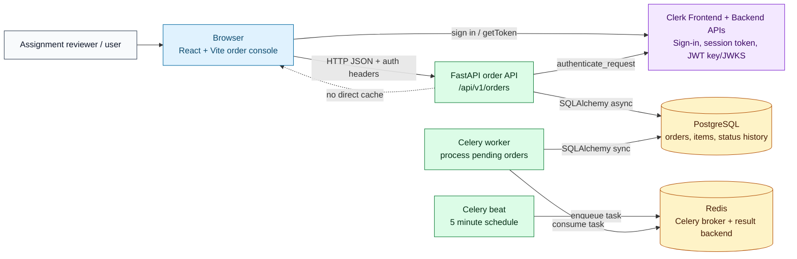

## 3. Runtime Container Diagram

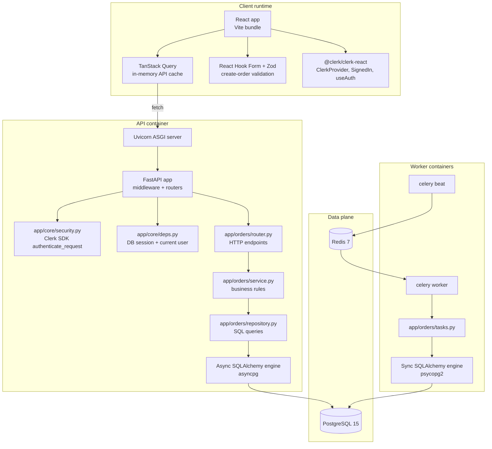

## 4. Repository Layout

```text
.
|-- architecture.md
|-- backend/
|   |-- app/
|   |   |-- core/          # settings, database, auth, dependencies, exceptions, logging
|   |   |-- middleware/    # request ID middleware
|   |   |-- orders/        # order feature: router, schemas, models, repo, service, task
|   |   `-- workers/       # Celery app and sync DB setup
|   |-- alembic/           # migration environment and initial schema
|   |-- tests/             # unit + integration tests
|   |-- Dockerfile
|   |-- docker-compose.yml
|   `-- pyproject.toml
`-- frontend/
    |-- src/
    |   |-- api/           # API client and auth header assembly
    |   |-- auth/          # Clerk/dev auth provider and role switch
    |   |-- data/          # demo fallback order data
    |   |-- lib/           # formatting, filtering, metrics, state helpers
    |   |-- App.tsx        # main order console UI
    |   `-- types.ts       # shared frontend data types
    |-- package.json
    `-- vite.config.ts
```

## 5. Backend Request Pipeline

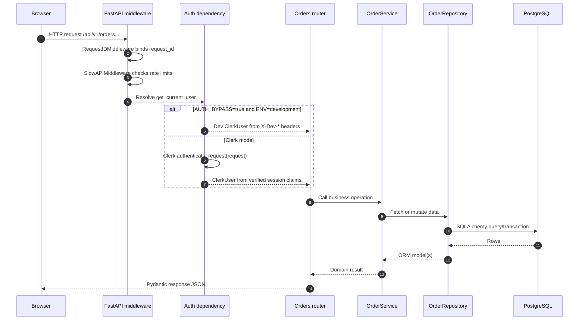

Backend layers:

| Layer | Files | Responsibility |
| --- | --- | --- |
| ASGI app | `backend/app/main.py` | App creation, middleware registration, routers, `/health`. |
| Middleware | `backend/app/middleware/request_id.py`, SlowAPI, CORS | Request IDs, rate limiting, browser origin policy. |
| Dependencies | `backend/app/core/deps.py` | DB session, current user, admin guard. |
| Auth | `backend/app/core/security.py` | Clerk SDK request authentication and role extraction. |
| Router | `backend/app/orders/router.py` | HTTP shape, status codes, query parameters, response models. |
| Service | `backend/app/orders/service.py` | Totals, authorization, state transitions, worker processing rules. |
| Repository | `backend/app/orders/repository.py` | SQLAlchemy queries, transactions, row locks, eager loading. |
| Models | `backend/app/orders/models.py` | SQLAlchemy tables, relationships, indexes. |
| Schemas | `backend/app/orders/schemas.py` | Pydantic validation and serialization. |

## 6. Frontend Flow

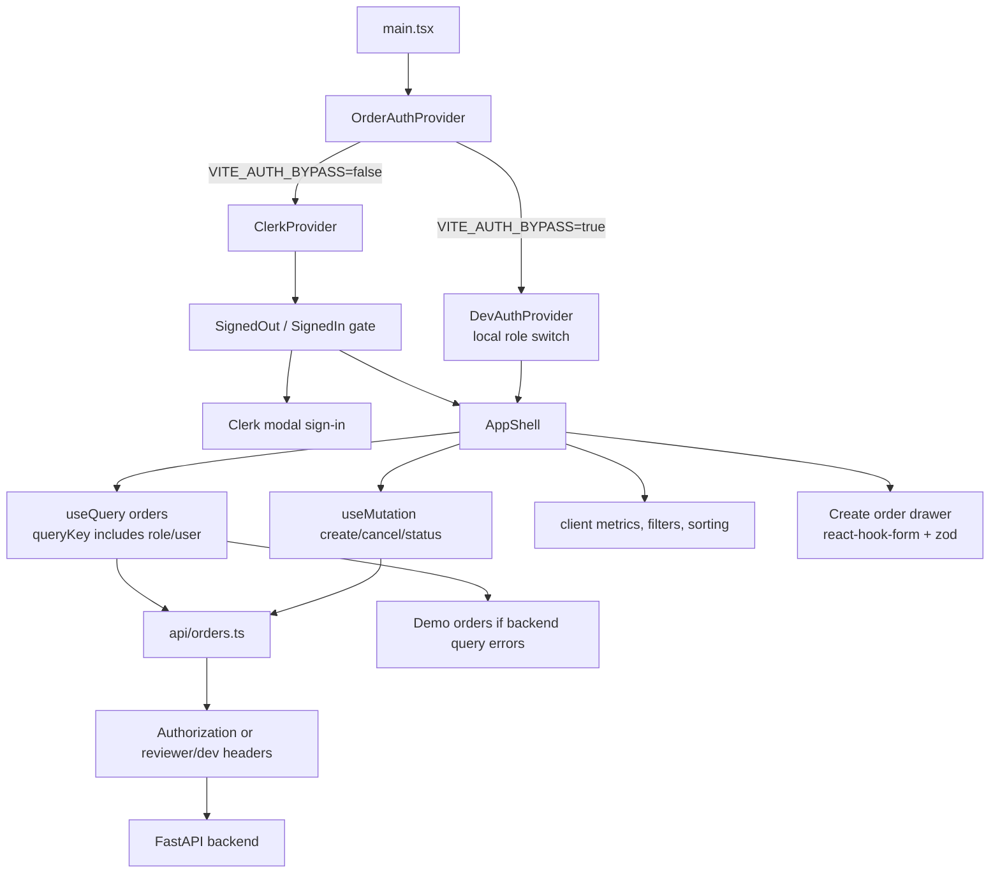

Frontend details:

- `OrderAuthProvider` chooses dev auth or Clerk auth from environment variables.
- Dev mode uses in-memory role state and emits `X-Dev-Role` / `X-Dev-User-Id`.
- Clerk mode uses `ClerkProvider`, `SignedIn`, `SignedOut`, `useAuth`, `useUser`, and `UserButton`.
- Clerk mode sends `Authorization: Bearer <session token>` from `useAuth().getToken()`.
- Local reviewer mode can still switch roles in the UI after Clerk sign-in. The API client adds:
  - `X-Reviewer-Role`
  - `X-Reviewer-User-Id`
  - `X-Dev-Role`
  - `X-Dev-User-Id`
- The backend decides which headers are honored based on `AUTH_BYPASS`, `ENV`, and
  `REVIEWER_ROLE_SWITCH_ENABLED`.
- TanStack Query caches order list responses in memory for the lifetime of the page.
- `retry: false` and `refetchOnWindowFocus: false` keep assignment behavior deterministic.
- If the order list request fails, the UI falls back to `demoOrders` and disables write actions.

## 7. Clerk Authentication Implementation

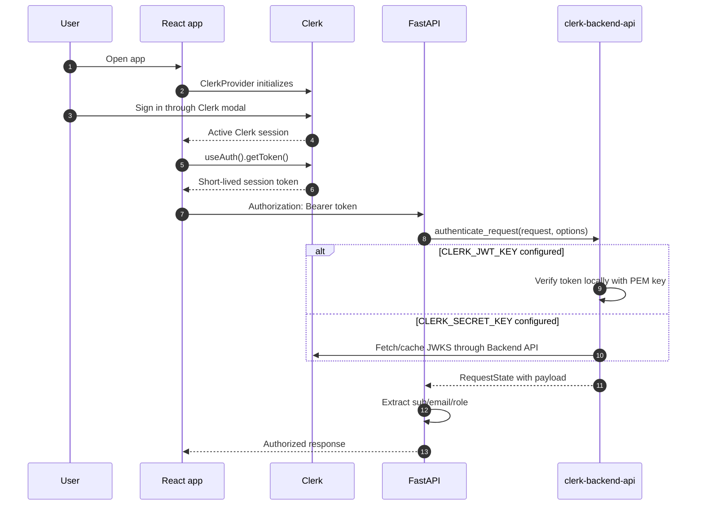

Backend auth behavior:

- `backend/app/core/security.py` uses Clerk's official Python SDK:
  - `AuthenticateRequestOptions(secret_key=..., jwt_key=..., audience=..., authorized_parties=...)`
  - `accepts_token=["session_token"]` so order endpoints accept user sessions only.
- `CLERK_JWT_KEY` is preferred for networkless verification.
- `CLERK_SECRET_KEY` can be used when the SDK should fetch/cache JWKS from Clerk's Backend API.
- `CLERK_AUTHORIZED_PARTIES` can restrict the `azp` claim to known frontend origins.
- Role extraction checks:
  - `role`
  - `org_role`
  - `metadata.role`
  - `public_metadata.role`
  - `publicMetadata.role`
- Roles are normalized to `ADMIN` or `CUSTOMER`. Unknown roles become `CUSTOMER`.
- `require_admin` rejects non-admin users with `403 FORBIDDEN`.

Development reviewer behavior:

| Mode | Frontend setup | Backend behavior |
| --- | --- | --- |
| Dev bypass | `VITE_AUTH_BYPASS=true`, `AUTH_BYPASS=true`, `ENV=development` | Backend trusts `X-Dev-Role` and `X-Dev-User-Id`. |
| Clerk local review | `VITE_AUTH_BYPASS=false`, `VITE_REVIEWER_ROLE_SWITCH=true` | Backend first verifies Clerk session, then honors `X-Reviewer-Role` only in development. |
| Production | `ENV=production` | Reviewer override is ignored; Clerk claims decide identity and role. |

## 8. API Surface

| Method | Path | Role | Behavior |
| --- | --- | --- | --- |
| `GET` | `/health` | Public | Returns `{"status":"ok"}`. |
| `POST` | `/api/v1/orders` | Authenticated customer/admin | Creates a `PENDING` order for the current user. Rate limited. |
| `GET` | `/api/v1/orders` | Authenticated | Lists orders. Customers see only their orders; admins see all. Supports status/page/page_size. |
| `GET` | `/api/v1/orders/{order_id}` | Owner or admin | Returns one order with items and status history. |
| `PATCH` | `/api/v1/orders/{order_id}/status` | Admin | Applies a valid state transition. |
| `POST` | `/api/v1/orders/{order_id}/cancel` | Owner or admin | Cancels an order if transition is valid. Rate limited. |

Request and response boundaries:

- Create item validation:
  - `product_id` must be a UUID.
  - `quantity` must be positive.
  - `unit_price` must be positive.
  - `items` must not be empty.
- List pagination:
  - `page >= 1`
  - `1 <= page_size <= 100`
- Money is stored as `Numeric(10, 2)` / `Decimal`.
- Decimal response fields serialize as strings to avoid floating point drift.
- Errors are wrapped as:

```json
{
  "error": {
    "code": "FORBIDDEN",
    "message": "You do not have access to this resource",
    "request_id": "..."
  }
}
```

## 9. Order Domain Model

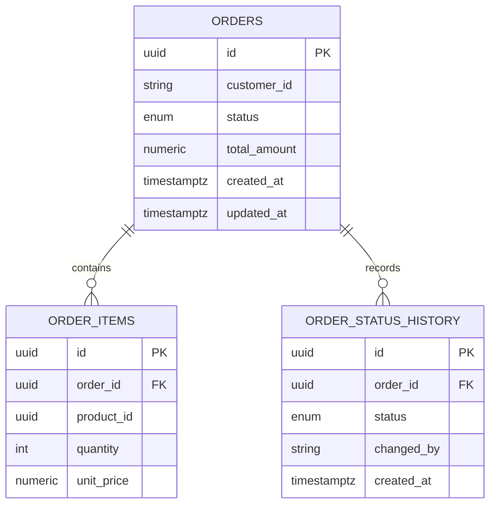

Database design details:

- `orders.id`, `order_items.id`, and `order_status_history.id` are UUID primary keys.
- `order_items.order_id` and `order_status_history.order_id` cascade on order deletion.
- `orders.customer_id` stores the Clerk user ID or reviewer dev ID.
- Status is stored as a non-native SQL enum string constraint through SQLAlchemy.
- Indexes:
  - `ix_orders_customer_id`
  - `ix_orders_status`
  - `ix_orders_customer_status_created`
  - `ix_order_items_order_id`
  - `ix_order_items_product_id`
  - `ix_order_status_history_order_id`
- The composite order index supports the common customer/status/created listing path.
- Relationships use `selectin` loading to avoid N+1 queries when returning orders with items/history.

## 10. State Machine

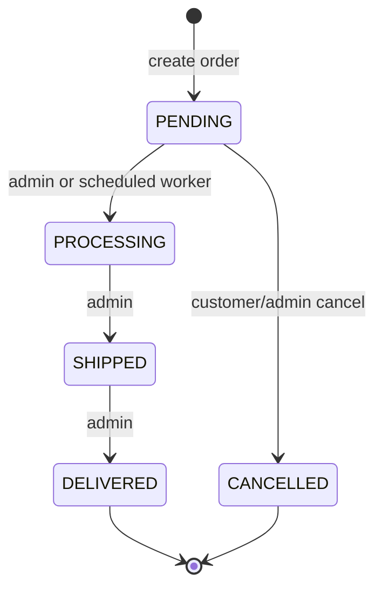

Transition rules are centralized in `VALID_TRANSITIONS` and enforced by `OrderService`:

| Current | Allowed next states |
| --- | --- |
| `PENDING` | `PROCESSING`, `CANCELLED` |
| `PROCESSING` | `SHIPPED` |
| `SHIPPED` | `DELIVERED` |
| `DELIVERED` | none |
| `CANCELLED` | none |

Every status mutation appends an `OrderStatusHistory` row with `changed_by`.

## 11. Background Processing

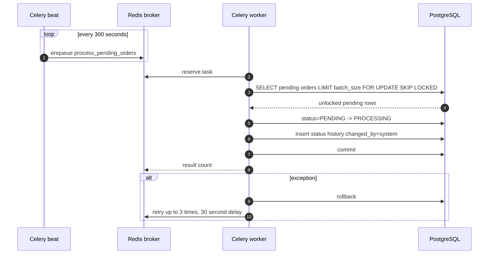

Worker details:

- Celery app is configured in `backend/app/workers/celery_app.py`.
- Redis is both the broker and result backend.
- Beat schedules `app.orders.tasks.process_pending_orders` every 300 seconds.
- The default batch size is 100.
- The task retries up to 3 times with a 30 second delay.
- Worker code uses a synchronous SQLAlchemy engine because Celery tasks are synchronous.
- `with_for_update(skip_locked=True)` lets multiple workers safely process different pending orders
  without waiting on the same rows.

## 12. Concurrency and Consistency

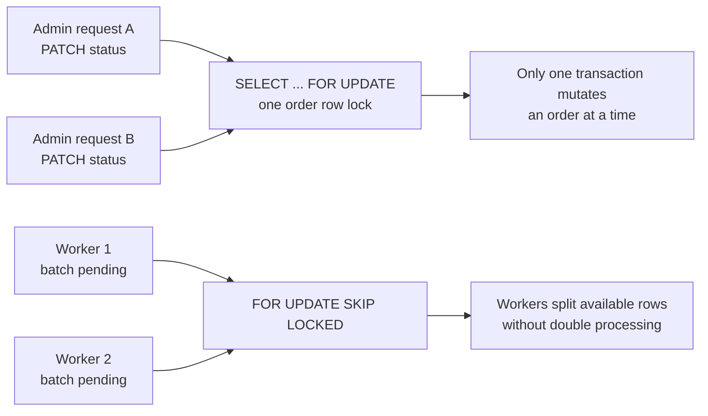

Implemented consistency features:

- Per-request async DB sessions are created through `AsyncSessionLocal`.
- API mutations commit inside repository methods.
- `get_for_update()` locks individual orders before status changes and cancellation.
- Worker batch selection uses `FOR UPDATE SKIP LOCKED`.
- Status transitions are validated after acquiring the locked row.
- Status history is written in the same transaction as the status update.
- `pool_pre_ping=True` avoids stale DB connections after restarts/network blips.

Concurrency considerations:

- Uvicorn can run multiple worker processes, but the compose command currently starts one Uvicorn
  process.
- Celery workers can be horizontally scaled; `SKIP LOCKED` protects against duplicate batch work.
- SlowAPI rate limiting is currently in-process because no distributed limiter storage is configured.
  For multi-API-instance production deployments, configure SlowAPI to use Redis.
- No idempotency key exists for `POST /orders`; repeated client retries can create duplicate orders.

## 13. Caching and Data Reuse

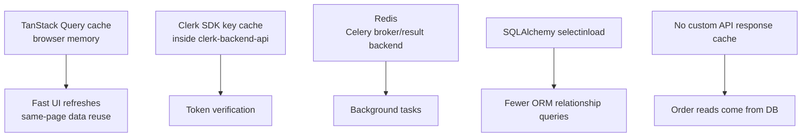

Current caching systems:

| Cache/system | Implemented where | What it stores | Scope | Notes |
| --- | --- | --- | --- | --- |
| TanStack Query | `frontend/src/App.tsx` | Order list query result | Browser tab memory | Query key includes role/user so reviewer switching refetches correctly. |
| Clerk SDK key cache | `clerk-backend-api` | JWKS/public key material when using `CLERK_SECRET_KEY` | Backend process memory | If `CLERK_JWT_KEY` is set, verification is networkless and does not need JWKS fetch. |
| Redis | Docker service + Celery config | Celery messages and results | Shared service | Used for background jobs, not API response caching. |
| SQLAlchemy relationship loading | Repository `.options(selectinload(...))` | ORM related rows per query | Request/session | Avoids N+1 relationship loading for items and history. |
| PostgreSQL buffer cache | PostgreSQL runtime | Hot table/index pages | Database process | Inherent DB behavior, not application-managed. |

Not currently implemented:

- No server-side HTTP response cache.
- No Redis read-through/write-through cache for orders.
- No CDN/static asset cache configuration in this repo.
- No persisted frontend cache across page reloads.

Why this is acceptable for the assignment:

- Orders are mutable and role-scoped, so DB-backed reads keep behavior simple and correct.
- The main scalability lever is database indexing plus pagination.
- Redis is reserved for asynchronous processing, where it provides the most architectural value.

## 14. Scalability Features

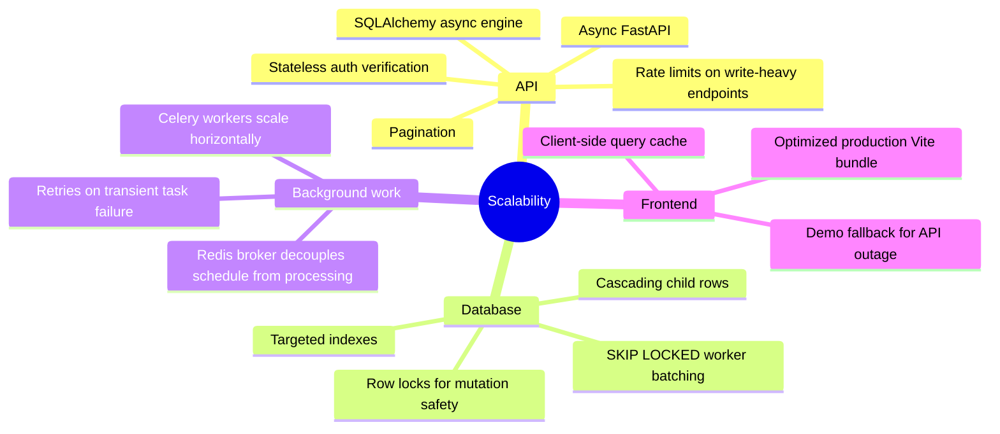

Horizontal scaling plan:

1. Run multiple API containers behind a load balancer.
2. Use `CLERK_JWT_KEY` so token verification is local and does not depend on Clerk network calls.
3. Configure SlowAPI with Redis storage for distributed rate limits.
4. Scale Celery workers independently from API containers.
5. Keep PostgreSQL as the source of truth; tune pool sizes per API/worker replica.
6. Add idempotency keys for order creation before enabling aggressive client/network retries.
7. Add read replicas only after measuring read pressure; current transactional reads should stay on
   primary until load requires separation.

Vertical tuning levers:

- Uvicorn process count.
- SQLAlchemy pool size and max overflow.
- PostgreSQL shared buffers/work memory/index maintenance.
- Celery worker concurrency.
- Celery `batch_size`.
- API `page_size` upper bound.

## 15. Rate Limiting

SlowAPI is installed as middleware and currently limits:

- `POST /api/v1/orders` to `20/minute`.
- `POST /api/v1/orders/{order_id}/cancel` to `20/minute`.

The limiter key uses `get_remote_address`, so limits are based on client IP. This is good enough for
local/demo use, but behind a production proxy you should confirm forwarded IP handling and use
shared Redis storage for multi-instance deployments.

## 16. Observability and Error Handling

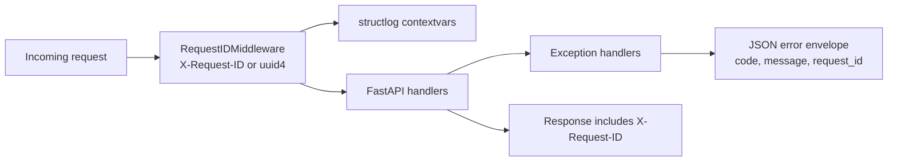

Implemented:

- `X-Request-ID` is accepted from the caller or generated per request.
- The request ID is bound into `structlog` context variables.
- Responses include `X-Request-ID`.
- HTTP, validation, and authentication exceptions are normalized into JSON.
- Logs are JSON rendered with log level and ISO timestamp.

Recommended next steps:

- Add access logs with request method/path/status/latency.
- Export metrics for request count, latency, rate-limit hits, DB pool usage, and Celery task duration.
- Add OpenTelemetry traces across API and worker code paths.
- Add Sentry or equivalent error aggregation.

## 17. Deployment Topology

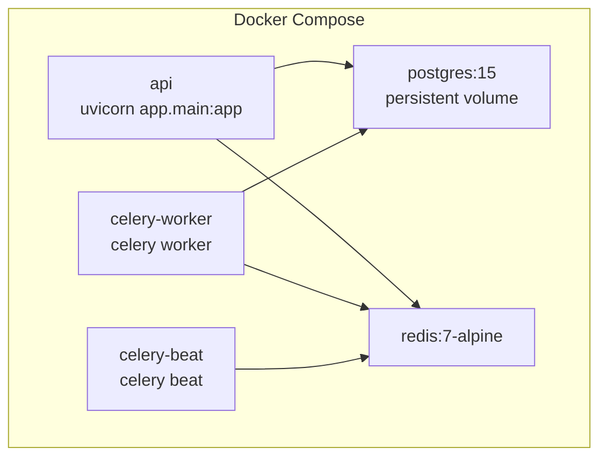

Compose details:

- `api` exposes port `8000`.
- `postgres` exposes port `5432` and uses a named volume.
- `redis` exposes port `6379`.
- Health checks gate API/worker/beat startup on PostgreSQL and Redis readiness.
- All backend services consume `.env`.
- Compose overrides `DATABASE_URL` and `REDIS_URL` to container hostnames.

Migration flow:

```bash
cd backend
docker compose up -d postgres redis
docker compose run --rm api alembic upgrade head
docker compose up --build
```

## 18. Load Testing Details

No committed load-test suite exists yet. The backend is shaped for load testing, and these are the
recommended scenarios and metrics to validate before production-like traffic.

### Targets

| Endpoint | Scenario | Expected behavior |
| --- | --- | --- |
| `GET /health` | High-rate liveness probe | Very low latency, no DB use. |
| `POST /api/v1/orders` | Customer order creation | Validates payload, writes order/items/history transactionally, rate limited. |
| `GET /api/v1/orders?page=1&page_size=100` | Customer/admin list | Uses pagination, role filtering, selectin relationship loading. |
| `PATCH /api/v1/orders/{id}/status` | Admin status transitions | Locks row and enforces transition graph. |
| `POST /api/v1/orders/{id}/cancel` | Customer cancel | Locks row, owner/admin check, rate limited. |
| Celery task | Pending order processing | Processes unique rows with `SKIP LOCKED`. |

### Metrics to collect

- p50, p90, p95, p99 latency per endpoint.
- Throughput in requests per second.
- 4xx/5xx count by error code.
- Rate-limit hit count.
- PostgreSQL CPU, active connections, locks, slow queries.
- Redis memory, command rate, queue depth.
- Celery processed count, retry count, task duration.
- API memory and CPU per replica.

### Suggested k6 smoke script

Save as `loadtest/orders-smoke.js` if you want to commit a load-test suite later.

```javascript
import http from "k6/http";
import { check, sleep } from "k6";

export const options = {
  scenarios: {
    smoke: {
      executor: "constant-vus",
      vus: 10,
      duration: "1m",
    },
  },
  thresholds: {
    http_req_failed: ["rate<0.01"],
    http_req_duration: ["p(95)<500"],
  },
};

const baseUrl = __ENV.API_BASE_URL || "http://localhost:8000";

export default function () {
  const headers = {
    "Content-Type": "application/json",
    "X-Dev-Role": "CUSTOMER",
    "X-Dev-User-Id": `customer-${__VU}`,
  };

  const create = http.post(
    `${baseUrl}/api/v1/orders`,
    JSON.stringify({
      items: [
        {
          product_id: "11111111-1111-4111-8111-111111111111",
          quantity: 1,
          unit_price: "25.00",
        },
      ],
    }),
    { headers },
  );

  check(create, {
    "create status is 201 or rate limited": (res) => res.status === 201 || res.status === 429,
  });

  const list = http.get(`${baseUrl}/api/v1/orders?page=1&page_size=20`, { headers });
  check(list, {
    "list status is 200": (res) => res.status === 200,
  });

  sleep(1);
}
```

Run:

```bash
k6 run -e API_BASE_URL=http://localhost:8000 loadtest/orders-smoke.js
```

### Load-test caveats

- Use `AUTH_BYPASS=true` only for local load tests. For auth-realistic tests, generate Clerk sessions
  through a controlled test account flow and send real bearer tokens.
- The create endpoint is rate limited to `20/minute` per client IP, so raise or disable that limit
  for sustained write throughput tests.
- In Docker Compose, PostgreSQL and Redis are single local containers; results are useful for
  regression checks, not capacity planning.
- Use unique customer IDs to measure customer-scoped list behavior.
- Use admin headers to test global order listing.

## 19. Verification Strategy

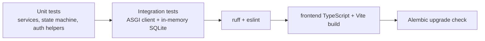

Current tests cover:

- Order total calculation.
- Access control for customer vs admin.
- Valid and invalid state transitions.
- Auth bypass and reviewer override behavior.
- Clerk SDK option wiring.
- Create/retrieve order flow.
- Customer isolation.
- Admin status update.
- Customer forbidden status update.
- Customer cancellation.
- Status filter and pagination.
- Celery pending-order processing.
- Health endpoint.
- CORS preflight from Vite.
- Frontend auth header behavior.
- Frontend app render/create form behavior.
- Frontend order utility functions.

Common verification commands:

```bash
cd backend
uv run --extra dev python -m pytest
uv run --extra dev ruff check .
uv run --extra dev mypy app
DATABASE_URL=sqlite+aiosqlite:///./local_alembic_check.db uv run --extra dev alembic upgrade head

cd ../frontend
npm run lint
npm run build
npm test
```

## 20. Security Posture

Implemented:

- Clerk session-token authentication through official backend SDK.
- Optional networkless token verification with `CLERK_JWT_KEY`.
- Optional `CLERK_AUTHORIZED_PARTIES` check.
- Admin-only endpoint dependency.
- Customer ownership checks.
- Dev auth bypass gated by `AUTH_BYPASS=true` and `ENV=development`.
- Reviewer role override ignored outside development.
- CORS allow-list from settings.
- Request validation through Pydantic/Zod.
- Rate limiting on write-heavy create/cancel endpoints.

Important production hardening:

- Set `ENV=production`.
- Set `AUTH_BYPASS=false`.
- Set `REVIEWER_ROLE_SWITCH_ENABLED=false`.
- Set `CLERK_JWT_KEY` or `CLERK_SECRET_KEY`.
- Set `CLERK_AUTHORIZED_PARTIES` to production frontend origins.
- Configure distributed SlowAPI storage.
- Put the API behind TLS and a trusted reverse proxy.
- Add idempotency keys for order creation.
- Add secret management instead of `.env` files.

## 21. Known Limits and Future Improvements

| Area | Current state | Recommended improvement |
| --- | --- | --- |
| Server-side caching | None for order reads | Add targeted Redis cache only after measuring read pressure and invalidation needs. |
| Rate limit storage | In-process default | Use Redis-backed shared limiter storage for multi-instance API. |
| Idempotency | Not implemented | Add `Idempotency-Key` for `POST /orders`. |
| Load tests | Documented plan, no committed suite | Commit k6 or Locust scripts and CI smoke thresholds. |
| Observability | Request IDs + JSON logs | Add metrics, tracing, structured access logs. |
| Worker visibility | Celery logs/result backend | Add task metrics and queue-depth dashboards. |
| Auth roles | Simple `ADMIN`/`CUSTOMER` | Move to Clerk organizations/permissions for richer RBAC. |
| Deployment | Docker Compose local topology | Add production IaC, health checks, autoscaling, secrets. |
| Frontend offline | Demo fallback only | Add explicit offline state and cached stale data display if needed. |

## 22. End-to-End Happy Paths

### Customer creates an order

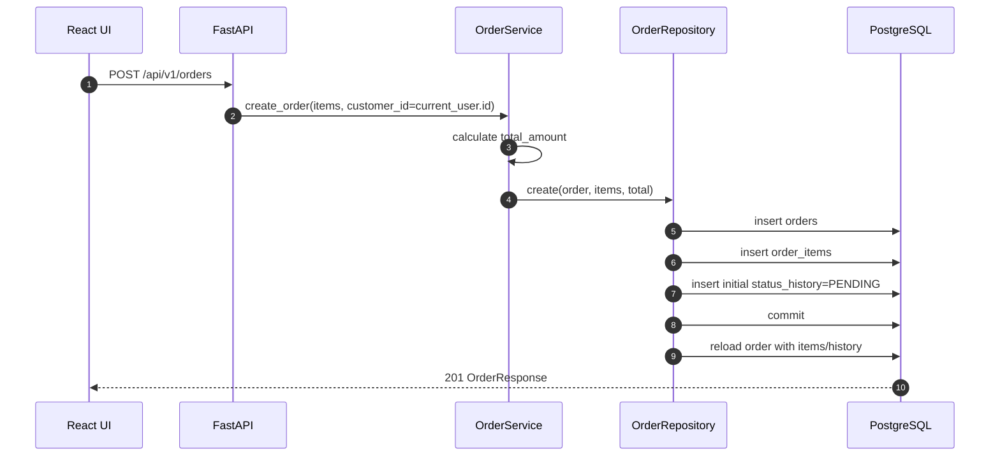

### Admin advances fulfillment

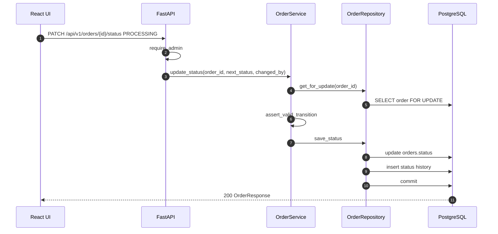

### Scheduled worker promotes pending orders

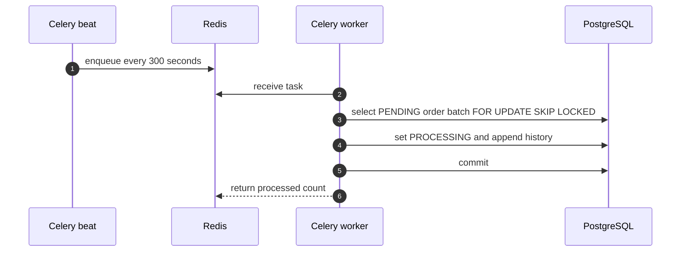
