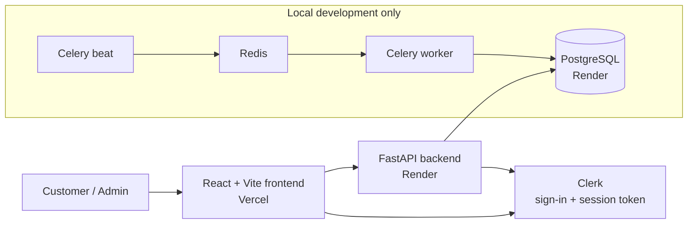
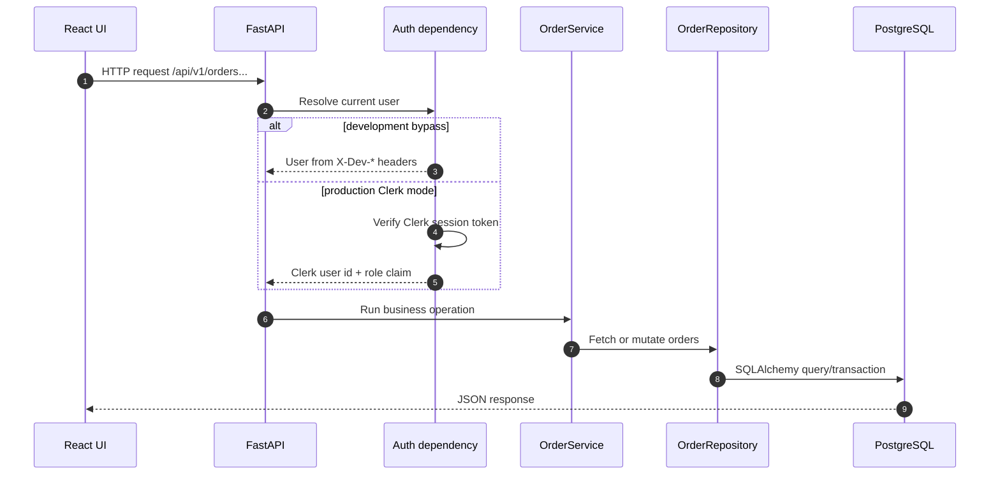
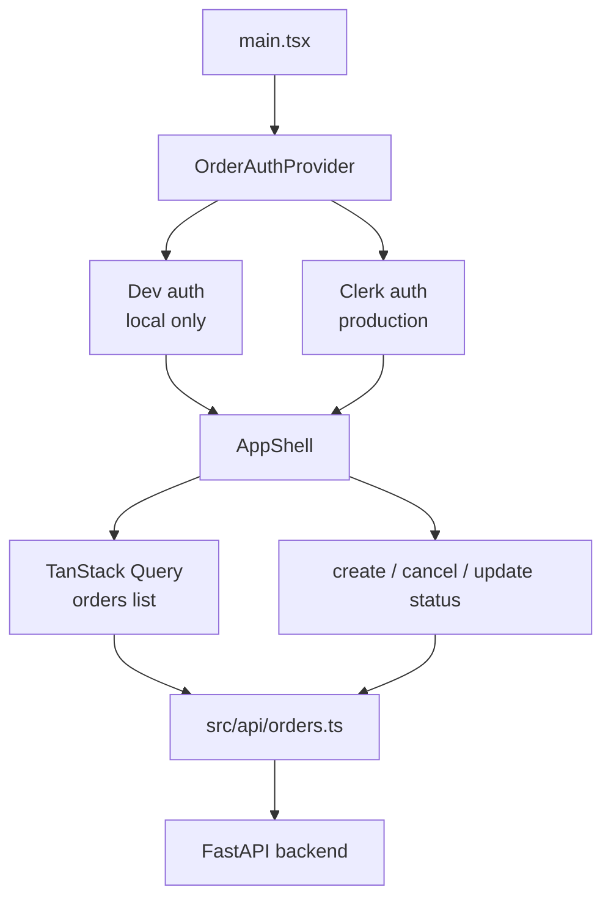
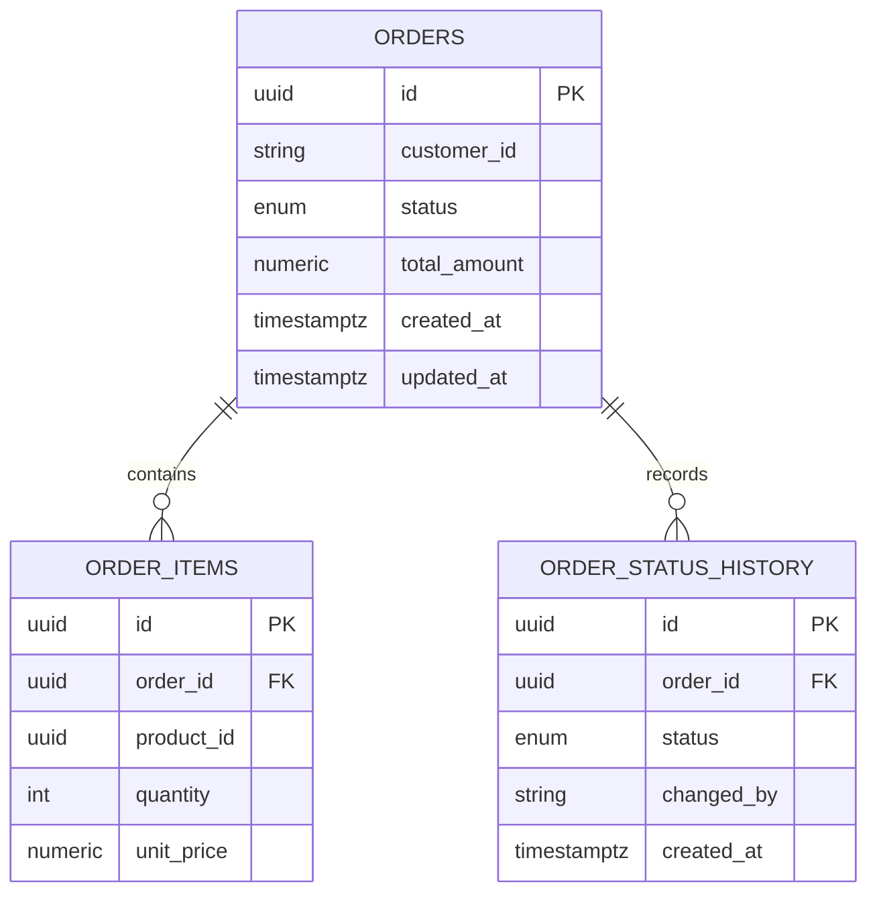
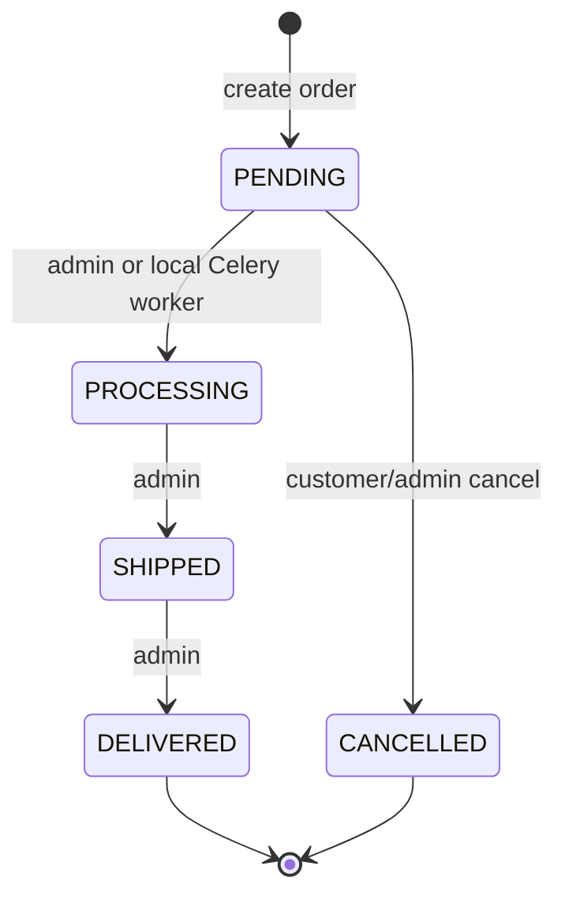
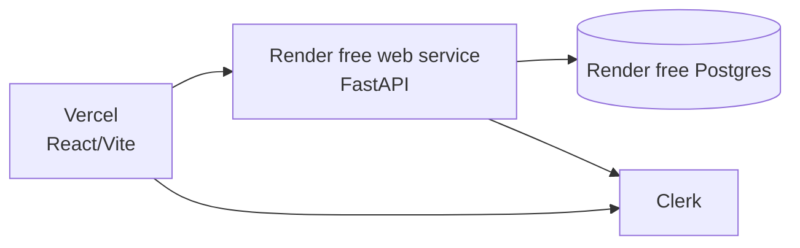
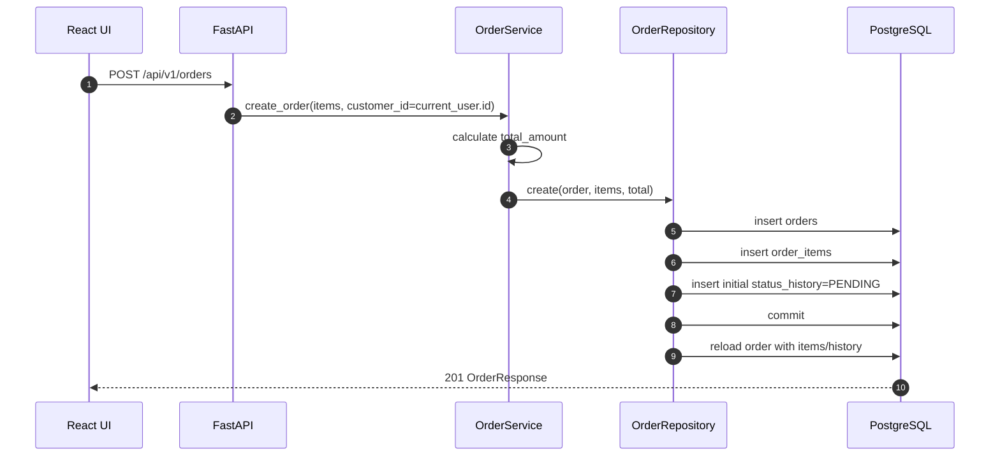
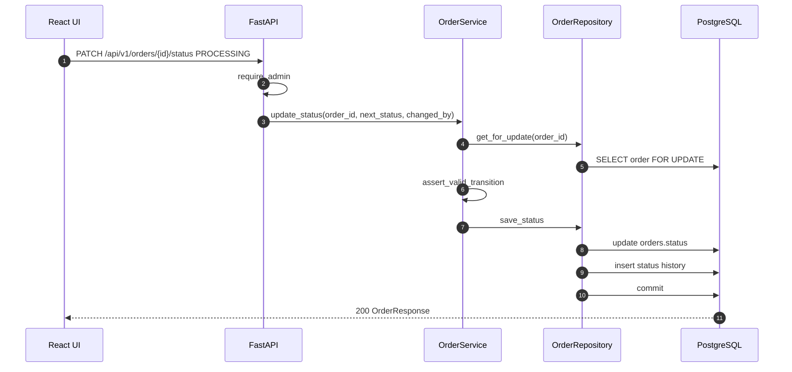
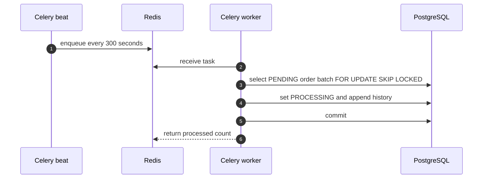

# E-Commerce Order Processing Architecture

This document summarizes the current assignment architecture. The app is intentionally small:
a React/Vite order console talks to a FastAPI backend, which stores orders in PostgreSQL and uses
Clerk for authentication.

## 1. Overview

- **Frontend:** React, Vite, TanStack Query, React Hook Form, Zod, Clerk React.
- **Backend:** FastAPI, Pydantic, SQLAlchemy 2.0, Alembic, Clerk backend SDK.
- **Database:** PostgreSQL with `orders`, `order_items`, and `order_status_history`.
- **Local background processing:** Celery + Redis are available in Docker Compose for development
  demos.
- **Production deployment:** Vercel hosts the frontend. Render hosts the backend web service and
  PostgreSQL. Production does not run Redis, Celery worker, Celery beat, or a scheduler, so orders
  remain `PENDING` until an admin updates them manually.

## 2. System Context



## 3. Backend Request Flow



Backend responsibilities:

| Layer | Main files | Responsibility |
| --- | --- | --- |
| App/core | `backend/app/main.py`, `backend/app/core/*` | Middleware, settings, CORS, auth, DB sessions, errors. |
| Orders API | `backend/app/orders/router.py` | HTTP routes, dependencies, response models. |
| Domain service | `backend/app/orders/service.py` | Authorization checks, totals, state transitions. |
| Persistence | `backend/app/orders/repository.py`, `models.py` | SQLAlchemy queries, locks, eager loading, writes. |

## 4. Frontend Flow



Frontend behavior:

- In development, `VITE_AUTH_BYPASS=true` enables role switching with reviewer headers.
- In production, Clerk sign-in provides the bearer token used for backend requests.
- The UI reads Clerk public metadata to display the user role, but backend authorization depends on
  role claims present in the Clerk session token.
- If the order list request fails, the UI shows demo data and disables write actions.

## 5. Authentication and Roles

Production requests use Clerk session tokens. The backend extracts role from the token payload using
these claims, in order:

- `role`
- `org_role`
- `metadata.role`
- `public_metadata.role`
- `publicMetadata.role`

Only `ADMIN` and `CUSTOMER` are accepted; unknown roles become `CUSTOMER`.

For production admin access, Clerk must include the role in the session token. A simple Clerk session
token customization is:

```json
{
  "role": "{{user.public_metadata.role}}"
}
```

Development-only shortcuts:

- `AUTH_BYPASS=true` and `ENV=development` let the backend trust `X-Dev-Role` and `X-Dev-User-Id`.
- `X-Reviewer-Role` is honored only in development and ignored in production.

## 6. API Surface

| Method | Path | Role | Behavior |
| --- | --- | --- | --- |
| `GET` | `/health` | Public | Health check. |
| `POST` | `/api/v1/orders` | Authenticated | Creates a `PENDING` order for the current user. |
| `GET` | `/api/v1/orders` | Authenticated | Customers see their orders; admins see all orders. |
| `GET` | `/api/v1/orders/{order_id}` | Owner or admin | Returns one order with items and history. |
| `PATCH` | `/api/v1/orders/{order_id}/status` | Admin | Applies a valid state transition. |
| `POST` | `/api/v1/orders/{order_id}/cancel` | Owner or admin | Cancels when the transition is valid. |

Errors use a consistent envelope:

```json
{
  "error": {
    "code": "FORBIDDEN",
    "message": "You do not have access to this resource",
    "request_id": "..."
  }
}
```

## 7. Data Model



Important details:

- `customer_id` stores the Clerk user id.
- Money uses `Numeric(10, 2)` / `Decimal` and serializes as strings.
- Order items and status history cascade when an order is deleted.
- Relationships use `selectinload` to avoid N+1 query behavior.
- Current indexes:
  - `ix_orders_customer_status_created`
  - `ix_orders_status_created`
  - `ix_order_items_order_id`
  - `ix_order_status_history_order_id`

## 8. State Machine



Allowed transitions:

| Current | Allowed next states |
| --- | --- |
| `PENDING` | `PROCESSING`, `CANCELLED` |
| `PROCESSING` | `SHIPPED` |
| `SHIPPED` | `DELIVERED` |
| `DELIVERED` | none |
| `CANCELLED` | none |

Every status mutation appends an `OrderStatusHistory` row with `changed_by`.

## 9. Local Background Processing

Celery exists for local/dev demonstration:

- `backend/app/workers/celery_app.py` configures Celery.
- Redis is the local broker and result backend.
- Celery beat enqueues pending-order processing every 300 seconds.
- The worker promotes `PENDING` orders to `PROCESSING` in batches.
- `FOR UPDATE SKIP LOCKED` prevents duplicate processing when workers overlap.

Production on the current free Render setup does not run this worker path.

## 10. Deployment

Current production deployment:



Render creates only:

- `ecommerce-orders-api`
- `ecommerce-orders-db`

There is no production Redis, worker, beat, or cron job. Free Render caveats are documented in
`DEPLOYMENT.md`.

## 11. Verification

Backend:

```bash
cd backend
uv run --extra dev python -m pytest
uv run --extra dev ruff check .
uv run --extra dev mypy app
DATABASE_URL=sqlite+aiosqlite:///./local_alembic_check.db uv run --extra dev alembic upgrade head
```

Frontend:

```bash
cd frontend
npm ci
npm test -- --run
npm run lint
npm run build
```

## 12. End-to-End Happy Paths

### Customer creates an order



### Admin advances fulfillment



### Local Celery worker promotes pending orders


